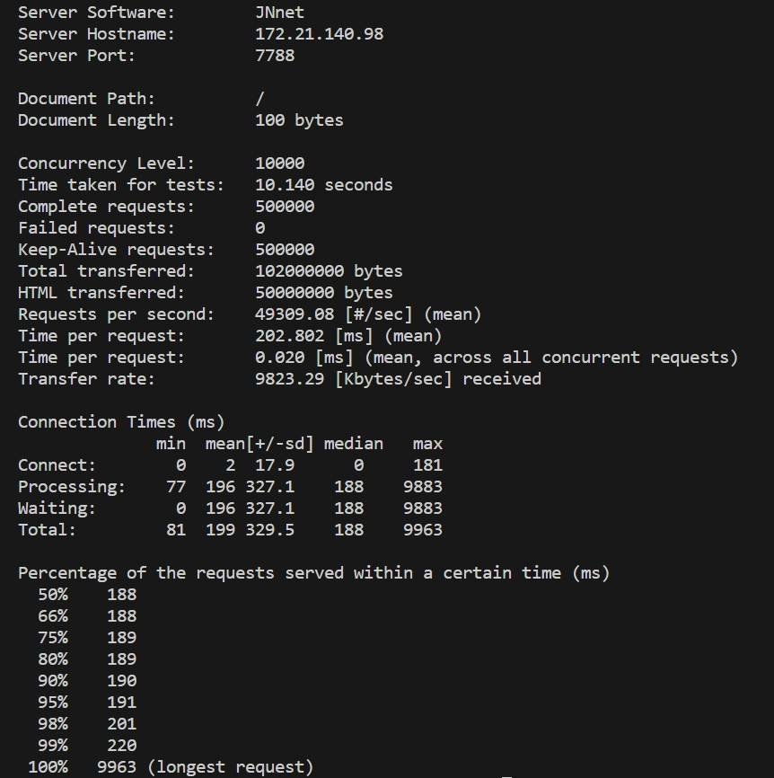

# JNnet网络库
# 使用
1. 安装根目录下JNnet库 `sudo ./build.sh`

2. 生成http服务器，`cd ./example/http_server` 然后 `make`

# 压力测试
10k个客户端发送500k个请求

# 主要类的实现
## Buffer类的设计
Buffer类设计是为了让网络库的阻塞尽量发生在`select/poll/epoll_wait`上的IO复用函数上。

非阻塞网络编程中Buffer的应用是必须的。

以发送视角来看

    对于一个网络程序想要发送100kb的数据给客户端，使用write函数向对应fd写入内容，但由于TCP拥塞控制，程序只能发送80kb，此时还剩下20kb的数据没有发送的对方，所以程序需要保留未发送的数据至Buffer中，然后注册POLLOUT事件后尽快交出控制权，待到以后发送。
以接收视角来看

    由于TCP是无边界的字节流协议，程序读到来自客户端的信息不一定完整，此时需要保留读取到的信息至结束，在通知业务逻辑解析。

Buffer主要是由`std::vector<char>`保存数据，其中还伴随两个位置索引`readIndex`,`writeIndex`来记录当前Buffer类中数据可读写的范围。
其中$[readIndex,writeIndex)$表示Buffer可读出数据的范围，$[writeIndex,size()]$表示可以向Buffer写入数据的范围。

对于需要写入超过`size()-writeIndex`的数据，会扩容Buffer的大小，并将readIndex的位置调整到最初的位置。
## Socket类的设计

## Channel类的设计
## EventLoop类的设计
## Acceptor的设计
